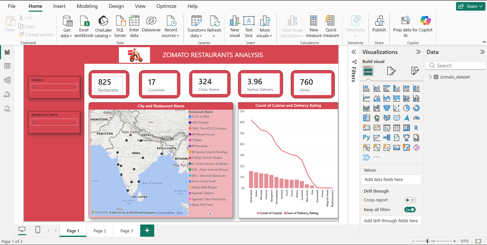
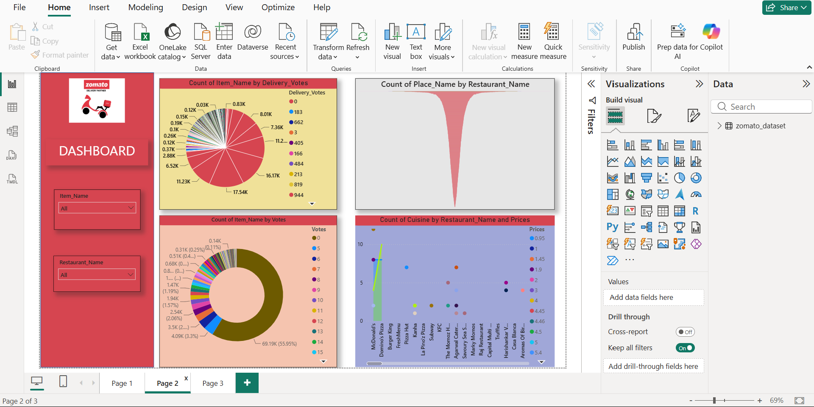
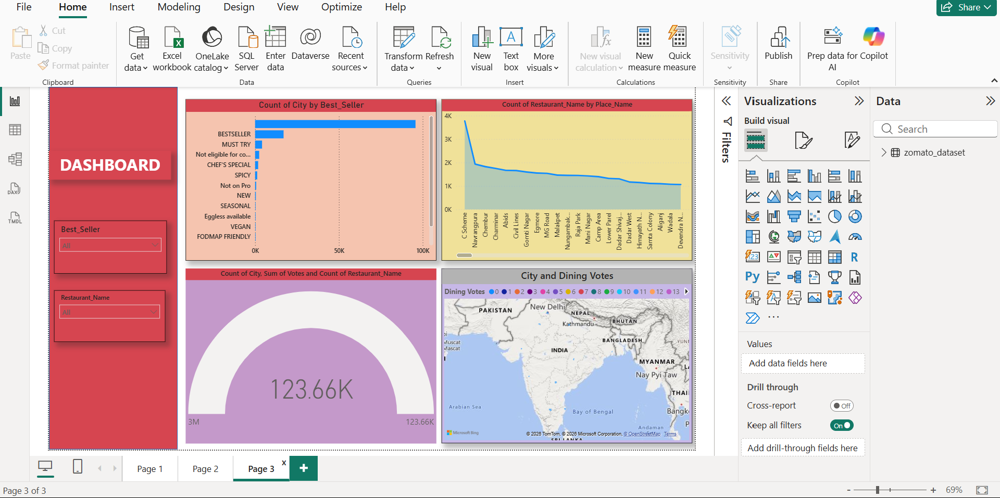

# 🍽️ Zomato Restaurant Analytics Dashboard (Power BI)

## 📌 Project Overview
A comprehensive Power BI analytics dashboard analyzing global and regional restaurant performance on Zomato, tracking restaurant density, cuisine distribution, online delivery ratings, and customer dining votes.

---

## 📊 Dashboard Views

### 1. Restaurant Overview & Geographic Footprint

### 2. Delivery Ratings & Vote Distribution

### 3. City-Wise Dining Trends & Best Sellers

---

## 🔑 Key Metrics & Business Insights Tracked
- **Geographic Reach:** Monitored restaurant distributions across 17+ countries and 320+ cities using interactive map visuals.
- **Rating & Performance Analysis:** Evaluated average delivery ratings vs. dine-in ratings across popular restaurant chains.
- **Cuisine Demand Trends:** Identified high-demand cuisines, vote shares, and top price-tier preferences.
- **City-Level Dining Volume:** Visualized total voting volumes and dining engagement trends across key metro regions.

---

## 🛠️ Tools & Technologies Used
- **Power BI Desktop:** Map integrations, donut charts, area charts, custom KPI cards, and slicers
- **Power Query:** Geocoding transformations, data cleaning, and dataset reshaping
- **DAX Measures:** Calculated average ratings, dynamic voting percentages, and restaurant aggregations
- **Dataset:** Zomato Global Restaurant Data (CSV/Excel)

---

## 📂 Repository Contents
- `zomato.bi.pbix` : Power BI Workbook File
- Zomato Dataset File (CSV/Excel)
- Screenshots: `zomato_overview.png`, `zomato_ratings_votes.png`, `zomato_city_dining.png`
